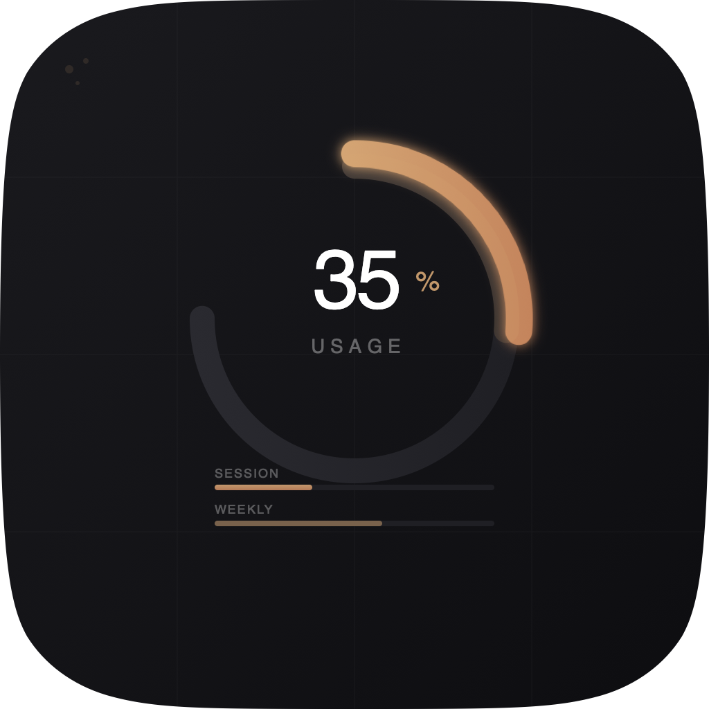
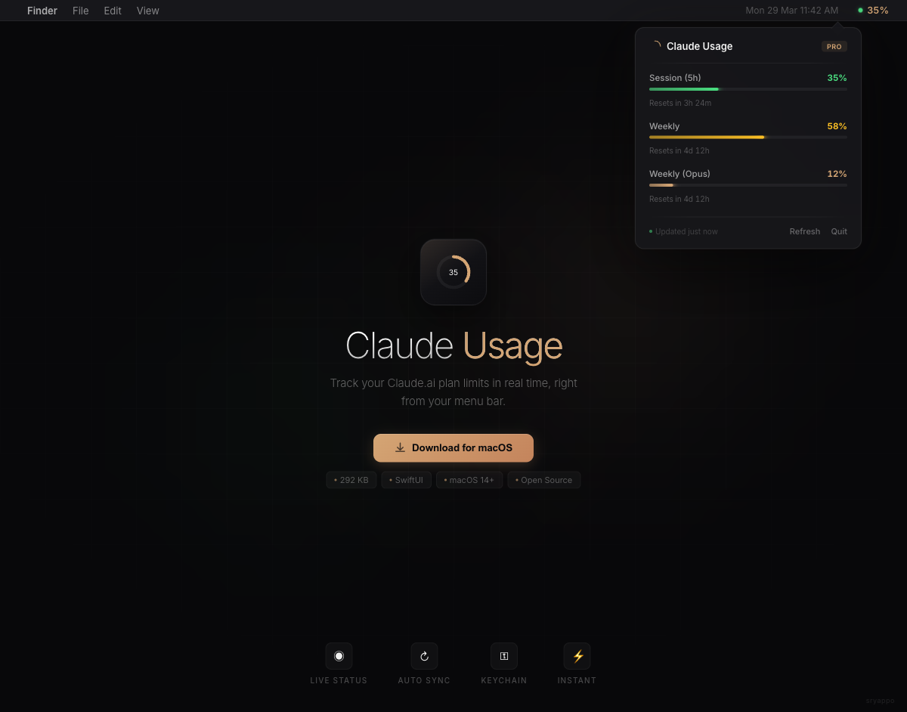
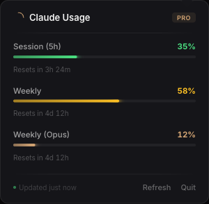

<p align="center">
  
</p>

<h1 align="center">Claude Usage</h1>

<p align="center">
  <strong>Track your Claude.ai plan limits in real time, right from your menu bar.</strong>
</p>

<p align="center">
  
  
  
  
</p>

<br />

<p align="center">
  
</p>

---

## What it does

A lightweight native macOS menu bar app that shows your **Claude.ai** plan usage — session (5-hour) and weekly limits — without opening a browser.

- **Live indicator** in the menu bar: `● 35%`
- **Click to expand** a popover with session, weekly, and Opus usage bars
- **Reset countdowns** so you know when your limits refresh
- **Auto-refreshes** every 3 minutes

<p align="center">
  
</p>

## Install

### Download

Grab the latest `ClaudeUsage.app` from [Releases](../../releases), or build from source:

### Build from source

```bash
git clone https://github.com/sryappo/claude-usage-app.git
cd claude-usage-app
./build.sh
open ClaudeUsage.app
```

To install permanently:

```bash
cp -r ClaudeUsage.app /Applications/
```

## Prerequisites

1. **macOS 14 (Sonoma)** or later
2. **Claude Code** installed and authenticated — run `claude login` if you haven't
3. First launch triggers a **Keychain access prompt** — click "Always Allow"

## How it works

```
┌─────────────┐     ┌──────────────────┐     ┌──────────────────────────┐
│  macOS       │────▶│  Keychain        │────▶│  Anthropic OAuth API     │
│  Keychain    │     │  "Claude Code-   │     │  /api/oauth/usage        │
│              │     │   credentials"   │     │                          │
└─────────────┘     └──────────────────┘     └──────────────────────────┘
                           │                            │
                           ▼                            ▼
                    OAuth Bearer Token           Usage JSON response
                                                  ├─ five_hour
                                                  ├─ seven_day
                                                  ├─ seven_day_opus
                                                  └─ extra_usage
```

1. Reads your Claude Code OAuth token from the macOS Keychain (set by `claude login`)
2. Polls `GET https://api.anthropic.com/api/oauth/usage` every 3 minutes
3. Displays utilization percentages with color-coded progress bars
4. Shows time remaining until each limit resets

## Tech

| | |
|---|---|
| **Language** | Swift 6 |
| **UI** | SwiftUI `MenuBarExtra` |
| **Auth** | macOS Keychain (`Security` framework) |
| **Size** | 292 KB (binary) |
| **Dependencies** | None — pure Apple frameworks |
| **Dock icon** | Hidden (`LSUIElement`) |

## Project structure

```
├── Package.swift                    # Swift Package Manager config
├── build.sh                         # Builds binary + creates .app bundle
├── Sources/ClaudeUsage/
│   ├── ClaudeUsageApp.swift         # @main — MenuBarExtra entry point
│   ├── UsageView.swift              # Popover UI with progress bars
│   ├── UsageViewModel.swift         # Polling logic and state
│   ├── UsageService.swift           # API client
│   ├── KeychainHelper.swift         # Keychain token extraction
│   └── Models.swift                 # Codable response types
├── icon.svg                         # App icon (source)
├── AppIcon.icns                     # App icon (bundled)
└── preview.html                     # Animated preview page
```

## Notes

- The OAuth API endpoint is **unofficial and undocumented** — it may change without notice
- Your OAuth token must have `user:profile` scope (default with `claude login`)
- The `anthropic-beta: oauth-2025-04-20` header is required
- No data leaves your machine except the authenticated API call to Anthropic

## License

MIT — (c) sryappo
